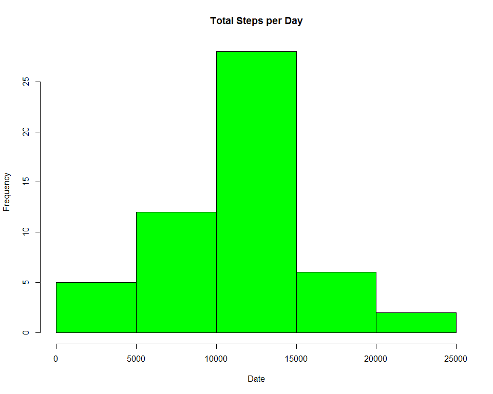

## Loading and preprocessing the data


```r
library(stats)
library(dplyr)
```

```
## 
## Attaching package: 'dplyr'
```

```
## The following objects are masked from 'package:stats':
## 
##     filter, lag
```

```
## The following objects are masked from 'package:base':
## 
##     intersect, setdiff, setequal, union
```

```r
activity_data <- read.csv("activity.csv")
activity_data <- filter(activity_data, steps != "NA")
```

## What is mean total number of steps taken per day?


#### Total steps per day


```r
total_steps_day <- activity_data %>% 
    group_by(date) %>%
    summarise(total_steps = sum(steps) )

hist(as.numeric(total_steps_day$total_steps),  col="green", xlab = "Date", main = "Total Steps per Day")
```

<!-- -->

#### Average and Median steps per day summarized in the table below


```r
print(total_steps_day %>%
    summarise(avg_steps = mean(total_steps), median_step = median(total_steps) )
)
```

```
## # A tibble: 1 x 2
##   avg_steps median_step
##       <dbl>       <int>
## 1     10766       10765
```

## What is the average daily activity pattern?


## Imputing missing values


## Are there differences in activity patterns between weekdays and weekends?
