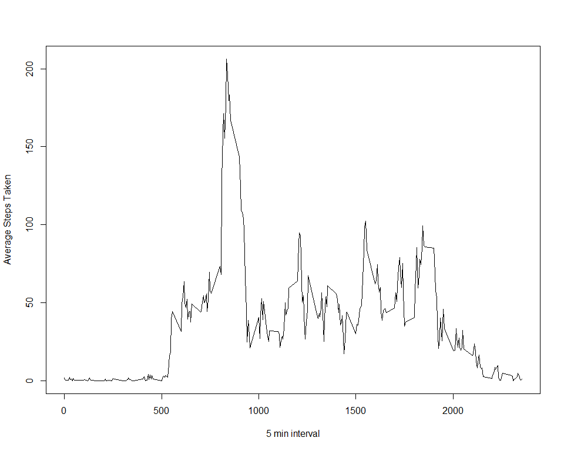
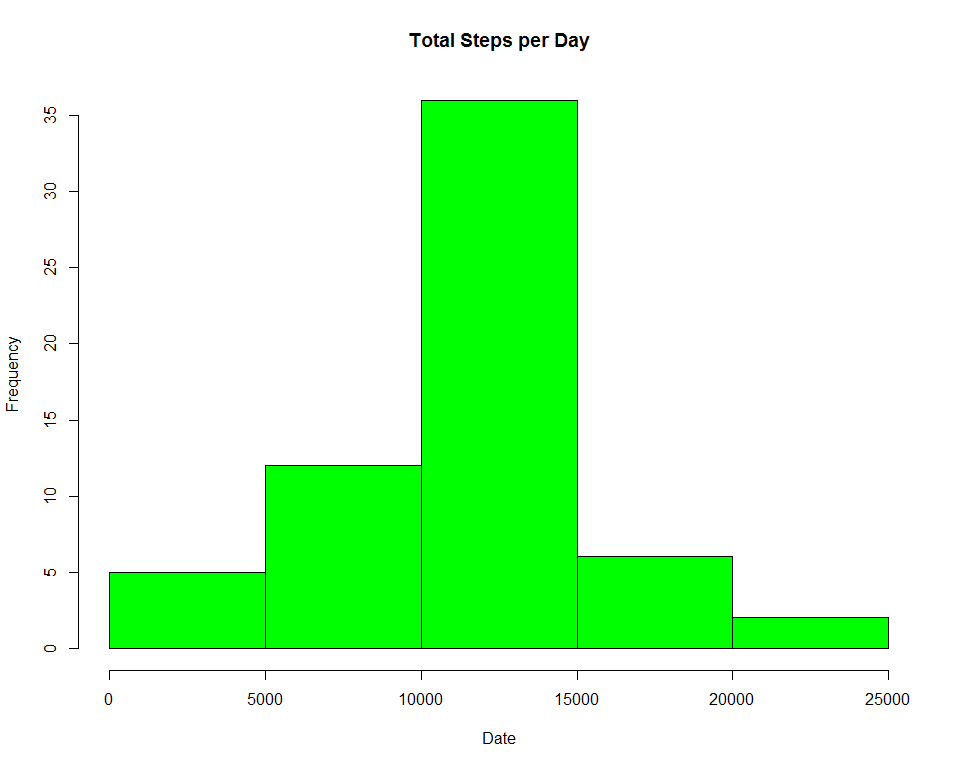

## Loading and preprocessing the data


```r
library(stats)
library(dplyr)
```

```
## 
## Attaching package: 'dplyr'
```

```
## The following objects are masked from 'package:stats':
## 
##     filter, lag
```

```
## The following objects are masked from 'package:base':
## 
##     intersect, setdiff, setequal, union
```

```r
activity_data <- read.csv("activity.csv")
activity_data <- filter(activity_data, steps != "NA")
```

## What is mean total number of steps taken per day?


#### Total steps per day


```r
total_steps_day <- activity_data %>% 
    group_by(date) %>%
    summarise(total_steps = sum(steps) )

hist(as.numeric(total_steps_day$total_steps),  col="green", xlab = "Date", main = "Total Steps per Day")
```

<!-- -->

#### Average and Median steps per day summarized in the table below


```r
print(total_steps_day %>%
    summarise(avg_steps = mean(total_steps), median_step = median(total_steps) )
)
```

```
## # A tibble: 1 x 2
##   avg_steps median_step
##       <dbl>       <int>
## 1     10766       10765
```


## What is the average daily activity pattern?

Compute the average number of steps per time interval


```r
average_steps_interval <- activity_data %>%
    group_by(interval) %>%
    summarise(avg_interval_steps = mean(steps) )
```


Time series plot of the interval and the average number of steps taken across all days


```r
with(average_steps_interval, plot(x=interval, y=avg_interval_steps, type = "l", xlab = "5 min interval", ylab = "Average Steps Taken"))
```

<!-- -->


The 5-minute interval with the highest average number of steps accross all days


```r
print(average_steps_interval %>%
      summarise(max_step_interval = max(avg_interval_steps))
      )
```

```
## # A tibble: 1 x 1
##   max_step_interval
##               <dbl>
## 1               206
```
      
## Imputing missing values

This time get all data, not just non-NA

```r
activity_data_full <- read.csv("activity.csv", stringsAsFactors = F)
```


Cursor through each row in the data frame; if the steps are NA in that row, find the corresponding interval step average
computed in average_steps_interval data frame and replace the NA with that interval average

```r
 for(i in 1:nrow(activity_data_full)) {

      if(is.na(activity_data_full[i,1])) {
          activity_row <- filter(average_steps_interval, interval == activity_data_full[i,3])
          activity_data_full[[i,1]] =  activity_row[[1,2]]
      }
 }
```

# Total steps per day


```r
total_steps_day <- activity_data_full %>% 
  group_by(date) %>%
  summarise(total_steps = sum(steps) )
```

# Average and Median steps per day


```r
print(total_steps_day %>%
        summarise(avg_steps = mean(total_steps), median_step = median(total_steps) )
)
```

```
## # A tibble: 1 x 2
##   avg_steps median_step
##       <dbl>       <dbl>
## 1     10766       10766
```

#Histogram of Total steps per day

```r
hist(as.numeric(total_steps_day$total_steps),  col="green", xlab = "Date", main = "Total Steps per Day")
```

<!-- -->


## Are there differences in activity patterns between weekdays and weekends?
